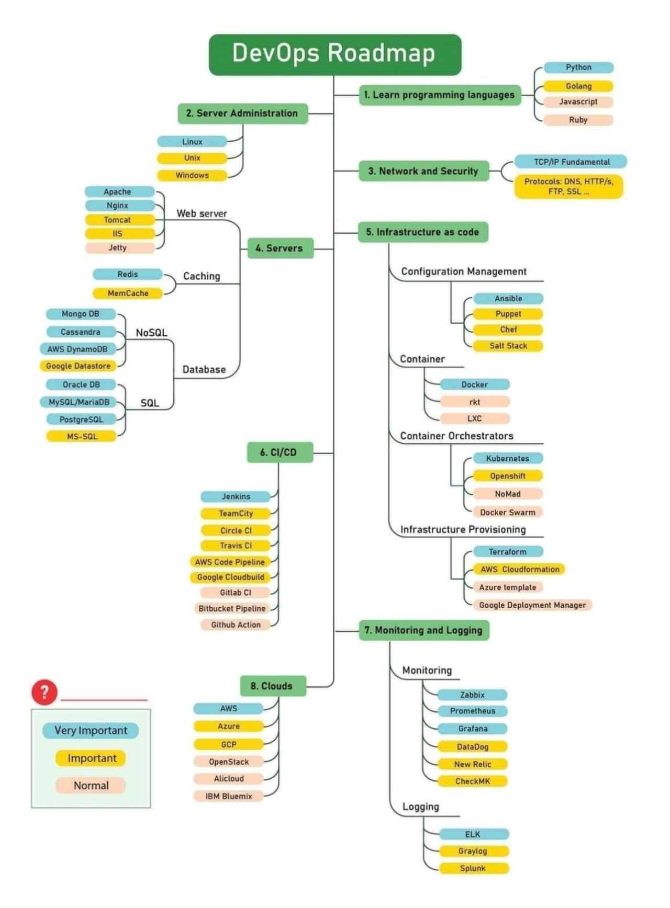

# YOUTUBE LINKS TO LEARN DEVOPS

source : https://www.linkedin.com/posts/ann-felix70_devops-aws-python-activity-6967727771238174721-K0__?utm_source=share&utm_medium=member_desktop

1. Linux :
   Basic Linux commands are necessary before jumping into shell scripting.

   - [Introduction to Linux](https://www.edx.org/course/introduction-to-linux)
   - [Linux Full Course In 5 Hours](https://www.youtube.com/watch?v=Wgi-OfbP2Gw)
   - [Linux Administration Tutorial](https://www.youtube.com/watch?v=aaEoyVIowk8)

2. Shell Scripting:

   - [Shell Scripting Tutorial](https://www.youtube.com/watch?v=GtovwKDemnI)
   - [Bash Tutorial: How to Use the Command Line in Linux, Windows, and Mac Terminal](https://www.youtube.com/watch?v=BFMyUgF6I8Y)

3. Python: This will help you in automation

   - [Python Tutorial for Beginners - Learn Python in 5 Hours](https://www.youtube.com/watch?v=t8pPdKYpowI)
   - [Automate with Python – Full Course for Beginners](https://www.youtube.com/watch?v=PXMJ6FS7llk)
   - [Python Tutorial - Python Full Course for Beginners](https://www.youtube.com/watch?v=_uQrJ0TkZlc)

4. Networking

   - [Learn Essential Computer Networking for Cloud](https://www.youtube.com/watch?v=BF9vXJ9sDAs)
   - [Computer Networking Full Course - OSI Model Deep Dive with Real Life Examples](https://www.youtube.com/watch?v=IPvYjXCsTg8)

5. Git & Github

   - [Complete Git and GitHub Tutorial](https://www.youtube.com/watch?v=apGV9Kg7ics)
   - [Git Tutorial for Beginners: Learn Git in 1 Hour](https://www.youtube.com/watch?v=8JJ101D3knE)

6. YAML

   - [Complete YAML Course](https://www.youtube.com/watch?v=IA90BTozdow&feature=youtu.be)
   - [YAML Tutorial for Beginners: Learn YAML in-depth for DevOps](https://www.youtube.com/watch?v=GOk4IoYhM9U)

7. Containers — Docker:

   - [Learn Docker - DevOps with Node.js & Express](https://www.youtube.com/watch?v=9zUHg7xjIqQ)
   - [Docker deep dive and RKE](https://www.youtube.com/watch?v=GwXLNAcHk-k)
   - [Docker Tutorial for Beginners](https://www.youtube.com/watch?v=pTFZFxd4hOI)

8. Continuous Integration & Continuous Deployment (CI/CD):

   - [Jenkins Full Course in 4 Hours](https://www.youtube.com/watch?v=3a8KsB5wJDE)

9. Container Orchestration — Kubernetes:

   - [Kubernetes Tutorial for Beginner](https://www.youtube.com/watch?v=X48VuDVv0do)

10. Monitoring:

    - [Prometheus Tutorial](https://www.youtube.com/watch?v=7gW5pSM6dlU)
    - [Monitoring using Prometheus and Grafana](https://www.youtube.com/watch?v=cF2P9d7rBlg)
    - [Intro to Kubernetes monitoring](https://www.youtube.com/watch?v=B5UY-qeW96I)
    - [Nagios Monitoring Tool Tutorial](https://www.youtube.com/watch?v=s9xCXZNVpac)

11. Infrastructure Provisioning & Configuration Management (IaC): Terraform, Ansible, Pulumi

    - [Terraform Course - Automate your AWS cloud infrastructure](https://www.youtube.com/watch?v=SLB_c_ayRMo)
    - [Ansible Full Course](https://www.youtube.com/watch?v=9Ua2b06oAr4)
    - [HashiCorp Terraform Associate Certification Course](https://www.youtube.com/watch?v=V4waklkBC38)
    - [Ansible Course for Beginners - Learn Ansible in 1 Hour](https://www.youtube.com/watch?v=s4cXrNEDYiw)
    - [Pulumi - IaC in your favorite programming language!](https://www.youtube.com/watch?v=vIjeiDcsR3Q)

12. CI/CD Tools: Jenkins, GitHub Actions, GitLab CI, Travis CI, AWS CodePipeline + AWS CodeBuild, Azure DevOps, etc

    - [Jenkins Practical Beginners Course for DevOps](https://www.youtube.com/watch?v=wHtIWvb5nzo&list=PL7kXAf0BmEquRcpI2M2mSaqOD84w2XVhF)
    - [GitHub Actions Basic Concepts Explained With Real Life Use Case Demo | EP 1](https://www.youtube.com/watch?v=sdl0eovbmyE)
    - [AWS CodeCommit | DevOps With AWS Ep.1](https://www.youtube.com/watch?v=0649R_Fk9_E&list=PL7kXAf0BmEqura2P3brCGE4pIfeSh-kgw)
    - [GitLab CI/CD Pipeline](https://www.youtube.com/watch?v=HSV-Kky9N5E)
    - [Travis CI + GitHub Pages - Automated deployment](https://www.youtube.com/watch?v=BFpSD2eoXUk)
    - [DevOps with GitLab CI Course - Build Pipelines and Deploy to AWS](https://www.youtube.com/watch?v=PGyhBwLyK2U)

13. AWS:

    - [AWS Tutorial For Beginners](https://www.youtube.com/watch?v=k1RI5locZE4)
    - [AWS Certified Solutions Architect Associate 2022 | FULL COURSE](https://www.youtube.com/watch?v=BRuvq59miIo)
    - [AWS DevOps | AWS DevOps Tutorial For Beginners | AWS DevOps Training | Intellipaat](https://www.youtube.com/watch?v=cI16T7GOPwM)
    - [AWS Full Course 2022 | AWS Tutorial For Beginners 2022 | AWS Training For Beginners | Simplilearn](https://www.youtube.com/watch?v=ZB5ONbD_SMY)

14. Learn how to SSH
    SSH using mobaxterm:

    - [how to ssh or telnet from windows using mobaxterm](https://www.youtube.com/watch?v=Diq9-b239vo)

15. SSH using Putty :

    - [How to Install PuTTY on Windows + SSH Connections Using PuTTY on Windows](https://www.youtube.com/watch?v=umFEuHWJW3w)

Best Websites to learn Devops:
[https://kodekloud.com](https://kodekloud.com)
[https://acloudguru.com](https://acloudguru.com)
[https://www.katacoda.com](https://www.katacoda.com)
