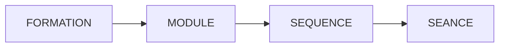

# Projet Toutatis

## TL;DR

- Ce projet fournit des ressources pour l'apprentissage des metiers du web.
- C'est plus un bookmark des bonnes ressources du web avec des exercices plutôt qu'un ensemble de cours.
- Pour le moment, il n'y a qu'une seule formation, [Développeur Web et Web Mobile](./formations/dwwm.md)
- **[C'est par là qu'on commence](./formations/dwwm.md)**

## Introduction

Vous trouverez ici des ressources pour vous aider dans l'apprentissage des métiers du web, en particulier les métiers de développeur et de designer.

Le nom de ce projet est un clin d'oeil d'oeil au [Projet Odin](https://www.theodinproject.com/) et essaye modestement d'en reprendre le principe, mais en langue française.
Je voulais trouver une divinité du savoir et de la connaissance en lien avec la France mais je n'ai rien trouvé. J'ai donc choisi [Teutatès](https://fr.wikipedia.org/wiki/Teutat%C3%A8s), un dieu Gaulois que les lecteurs d'Asterix connaissent sous le nom de Toutatis.

L'idée est de ne pas réinventer la roue et de proposer une trame d'apprentissage en choisissant les ressources les mieux appropriées sur le web. J'essaie à chaque fois de mettre des ressources en français, mais j'ajoute aussi des ressources en anglais qui sont pertinentes ou qui n'ont pas d'équivalent en anglais.

Pour le moment, le projet est un peu un fourre-tout de ce que j'avais déjà fait et trouvé. Je suis en train d'organiser tout ça.

## Apprentissage par modules

Nous avons fait le choix de découper la formation en module.
Un module est une unité autonome qui permet d'acquerir une ou un ensemble de compétences.
Une formation est composée de plusieurs modules.
Certains modules peuvent apparaitre dans plusieurs formations.
Certains modules peuvent avoir des prérequis.
Chaque module est décomposé en grandes parties, les séquences, qui sont elles-mêmes découpées en unités d'apprentissage appelées des séances.

Pour le moment, une seule formation est proposée, mais il y en a d'autres de prévues.

## Les formations

Ce projet a pour l'originie mon besoin d'avoir des ressources de bonne qualité pour les titres Designer Web et Développeur Web et Web Mobile.
Est venu s'ajouter à ces deux là, le titre Concepteur Développeur d'Application.

Ces trois formations seront donc les trois premières qui seront

Il y en a d'autres à venir.

## Contribuer

Il existe plusieurs façon de contribuer à ce projet :

- Correction d'orhographe et grammaire.
- Relecture, améioration et réécriture de passages.
- Ajout de cours ou d'exercices.
- Chasse aux liens brisés.
- Ajout de nouveaux liens pertinents.

Si vous voulez participer, n'hésitez pas à me contacter à l'adresse guillaume.ferrari@protonmail.com

## Licence

Ce projet est réalisé sous licence [Créative Commons : Attribution - Pas d’Utilisation Commerciale - Partage dans les Mêmes Conditions 4.0 International (CC BY-NC-SA 4.0)](https://creativecommons.org/licenses/by-nc-sa/4.0/deed.fr)

Vous pouvez donc partager et adapter son contenu, tant que vous créditez ce projet.

Vous ne pouvez pas revendre le contenu de ce projet, **vous pouvez par contre vous en servir dans le cadre de formation, comme support de cours**. Vous êtes même encouragé à le faire !
