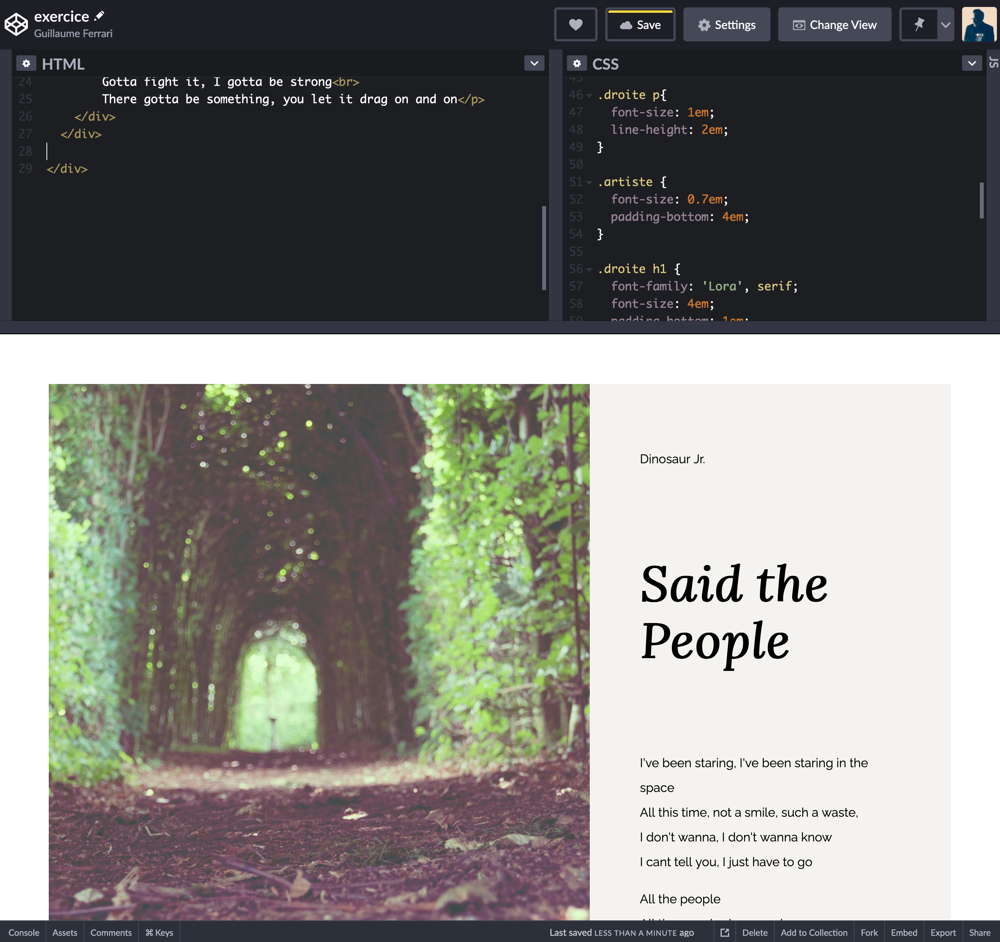

Voici un exercice pour pratiquer le HTML, le CSS, les animations et le javascript.

Si vous ne l'aviez pas encore fait, créez un compte sur codepen : https://codepen.io/

# Exercice 1 : Menu Burger

- Allez sur ce pen : https://codepen.io/guillaumeferrari/pen/ExyWZMW

- copiez-le sur votre propre compte en cliquant sur `fork` en bas à droite de l'écran. Vous pouvez maintenant le modifier et l'enregistrer.

- Ajouter le mot `MENU` en haut à droite de la page. Ce mot doit rester à la même place lorsque l'on scroll.

- Ajouter une balise `<nav>` avec la classe `menu` juste avant le dernier `
`

- Dans cette balise, ajoutez 6 éléments `<a>` avec comme contenu : FERMER, lien 1, lien 2, lien 3, lien 4 et lien 5

- Les liens sont en gris clair `#eee` et le background de `<nav>` est en gris foncé `#333`

- Le conteneur `<nav>` doit recouvrir intégralement la page et être fixe.

- Les liens de `<nav>` doivent être centré horizontalement et verticalement

- Le lien `FERMER` doit être positionné en haut à droite, au même endroit que le mot `MENU`, à la différence qu'il est à l'intérieur de `<nav>`

Vous devez avoir quelque chose comme ça :

- Ajouter la classe `menu_ouvert` à la div qui a la classe `container`

- Faire en sorte que quand la classe `menu_ouvert` est présente sur la `div.container` la `<nav>` soit affichée et lorsque l'on enlève cette classe, la `<nav>` disparait.

- En javascript, faire en sorte que lorsque l'on clique sur `MENU`, la classe `menu_ouvert` soit ajoutée sur `div.container` et lorsque l'on clique sur `FERMER` la classe `menu_ouvert` soit supprimée de `div.container`.

Après cette étape vous devriez avoir un menu burger fonctionnel.
