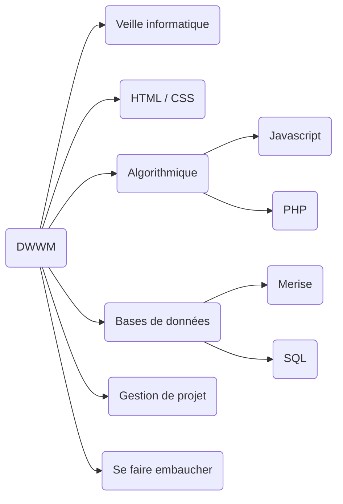

# Développeur Web et Web Mobile - DWWM

## A propos

DWWM est un titre professionnel de niveau 5 (Bac+2) homologué par le Ministère du Travail.

## Vue d'ensemble de la formation

Voici l'arborescence provisoire des modules qui composent la formation DWWM :

Cette arborescence est provisoire et sera enrichie au fur et à mesure.

Pour le moment, ces modules sont écrit :

- [Installation](../modules/Installation/README.md)
- [Installation pour les développeurs](../Modules/Installation/DWWM.md)
- [Veille technologique](../modules/Veille/README.md)
- [Algorithmique](../modules/algorithmique/README.md)
- [HTML/CSS](../modules/html/README.md)
- [Javascript](../modules/javascript/README.md)
- [Merise](../modules/merise/README.md)
- [PHP](../modules/php/README.md)
